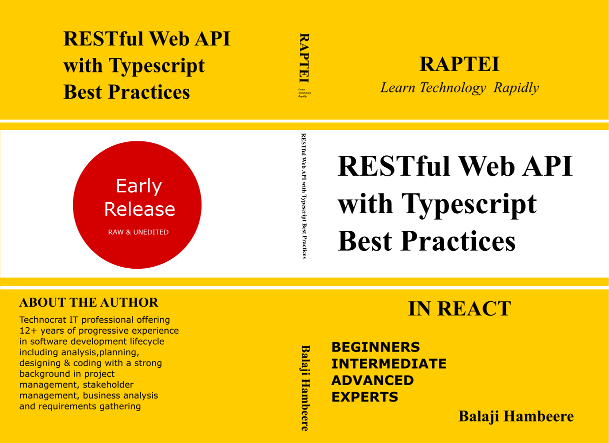

# RESTful Web API With Typescript Best Practices

### The code samples for RESTful Web API with Typescript Best Practices by Balaji Hambeere will soon publish on Amazon.

### If you want to learn how to build efficient & Complex RESTful Web API With Typescript, this book is for you. This Book provides best practices, principles and patterns for Designing RESTful Web API With Typescript.

#

